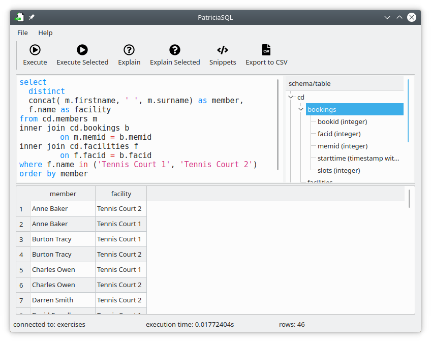
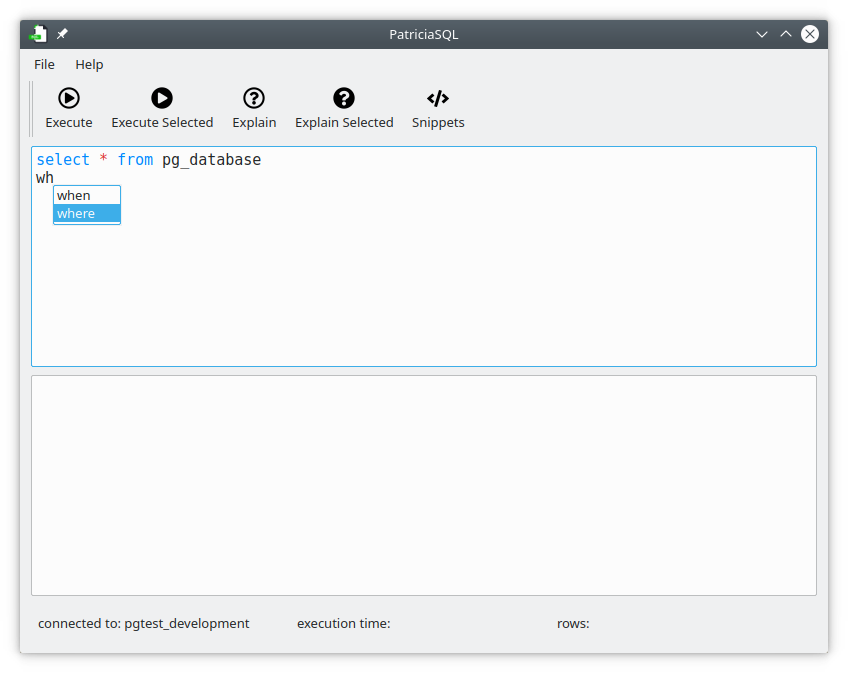
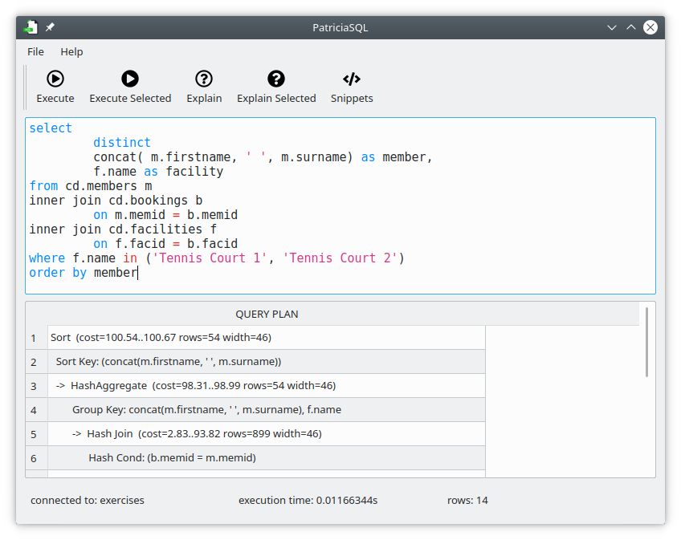
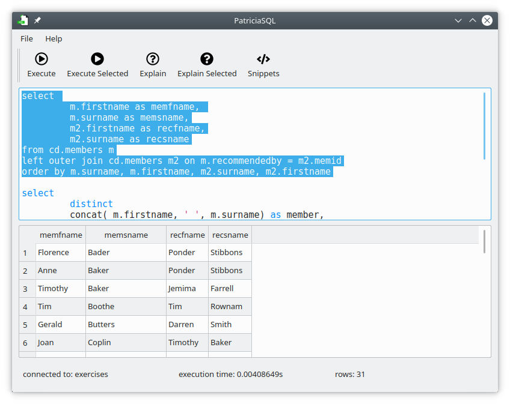
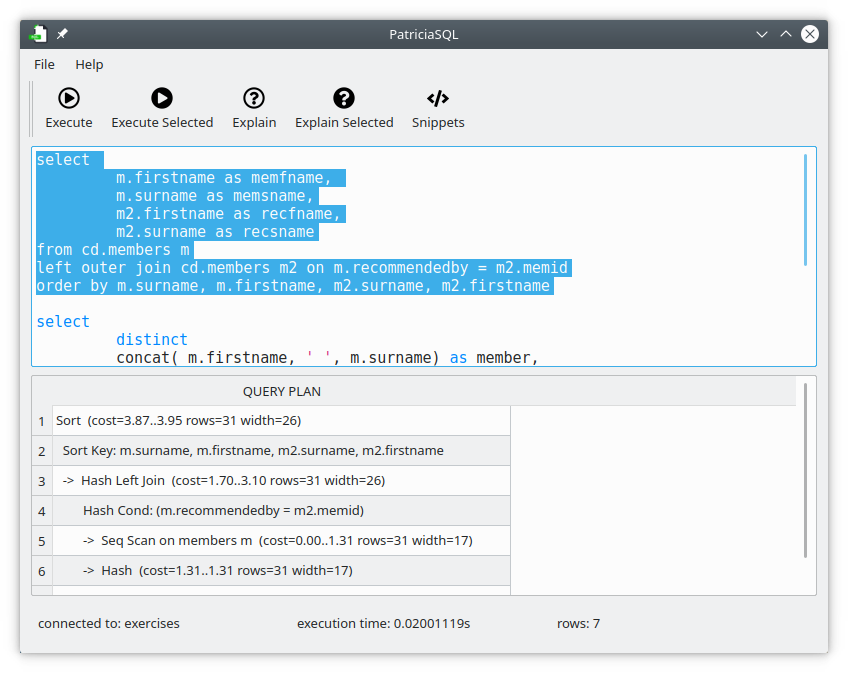
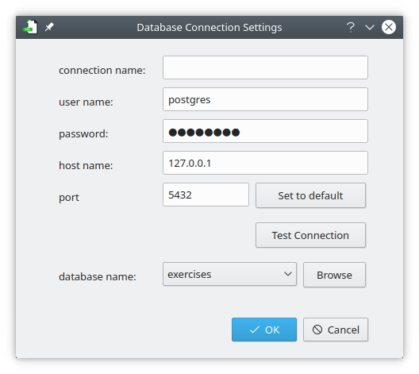

PatriciaSQL
=============

PatriciaSQL is simple PostgreSQL client written in PyQt (Qt GUI and Python). 

This tool has been developed under Kubuntu. PatriciaSQL has not been tested on other Linux distros, nor on other OSes (OSX, Windows, *BSD). PatriciaSQL should work without any problems as long as dependencies are met (see: [requirements](https://github.com/MaciekTalaska/PatriciaSQL#requirements) section for more info). Please mind that on some OSes additional dependencies may be required.

Screenshots:
------------

Main Window:

Auto-complete for SQL queries:

Query explain:

Executing only selected text:

Explain selected query:

Connection options:

**Note**: for demoing purposes data from [PostgreSQL Exercises](https://pgexercises.com/) is used

**Note**: in case of connectivity problems - try removing/editing configuration file that stores information of the last database connection used (`_patricia_connection.json`). If this does not work - please report a bug. Thanks!

Usage:
------

After setting up the connection, PatriciaSQL should be ready to use. To configure the connection use the "Connection Setup" dialog available from the main menu (`File -> Settings`).

Shortcuts:
----------
I like using shortcuts and most actions are available via key combinations:

<kbd>ctrl</kbd> + <kbd>Enter</kbd> - execute query - this takes the whole text from the editor window and treats it as a query

<kbd>ctrl</kbd> + <kbd>shift</kbd> + <kbd>Enter</kbd> - executes only the selected text

<kbd>ctrl</kbd> + <kbd>e</kbd> - performs explain on the query - query is the whole text from the editor control

<kbd>ctrl</kbd> + <kbd>shift</kbd> + <kbd>e</kbd> - performs explain on the selected text

<kbd>ctrl</kbd> + <kbd>k</kbd> - show auto-complete pop-up with all SQL keywords

Requirements:
---------------

- `Python` (either 2.7x or 3.x)
- `PostgreSQL` (tested with PosgreSQL 9, 10 & 11)
- `libqt5sql5-psql`  (PostgreSQL driver for KDE apps. It is required by any app that interacts with PostgreSQL)

Additional dependencies:

|Python 2.x | Python 3.x |
|-----------|------------|
| `python-pyqt5` | `python3-pyqt5` |
| `python-pyqt5.qtsql` | `python3-pyqt5.qtsql` |

Development:
--------------

Apart from what is listed above, some additional libraries & tools may be needed, in case you want to to work on this app.

1. Qt Designer (for forms design) `sudo apt install qt-creator`
2. PyQt5 dev tools: `sudo apt install pyqt5-dev-tools`

In case something does not work, try installing:
  * `python-pyside2.qtsql`
  
  or
  
  * `python3-pyside2.qtsql`

Todo:
------
This section should rather be entitled *"what would I like to have"*, as I am not sure I will have enough time to work on all of these:

 - [x] syntax highlighting for PgSQL statements
 - [x] load & save queries (from/to .sql files)
 - [x] save results to .csv
 - [ ] snippets (table/database creation, modification, removal...)
 - [x] query execution improvements:
    - [x] execute only highlighted text (execute one of many queries)
    - [x] 'execute and explain' + 'execute selected and explain'
    - [x] display db errors on query execution
 - [ ] general UI improvements:
    - [x] additional info on query execution (execution time)
    - [ ] solarized-light theme for the editor
 - [ ] auto-complete:
    - [x] keywords autocomplete
    - [ ] words used autocomplete
    - [ ] database names, table names, column names... (*)
 - [ ] .deb package
 - [x] store connection information in human readable format
   
(*) I am afraid that this is going to be pretty tricky one

Icons used:
-----------

App icon is taken from [ICONFINDER](https://www.iconfinder.com). The icon used is slightly modified [icon](https://www.iconfinder.com/icons/3876341/data_database_extension_file_sql_icon) which is part of [File Extensions Vol 1](https://www.iconfinder.com/iconsets/file-extension-vol-1) iconset.
Author of the app icon is: [Ravindra Kalkani](https://www.iconfinder.com/UN-icon)
Please note, that this icon is being used temporarily - until I get an icon made especially for PatriciaSQL.

Status bar icons are free [Font Awesome](https://fontawesome.com/icons?d=gallery&m=free) icons.
Font awesome license: https://fontawesome.com/license

No changes were made to Font Awesome icons.

To my best knowledge both Font Awesome, and the icon I found on IconFinder are free to use for OpenSource projects. If I am mistaken - let me know, please.

Disclaimer:
--------------
This is more of an experiment. I have no plans at the moment to make it a "full blown" tool. It should stay simple (and hopefully - fast). There are a couple of things I would like to improve (listed in TODO section), but working on it is not very high on my priority list (read: I may stop working on it at any moment).
