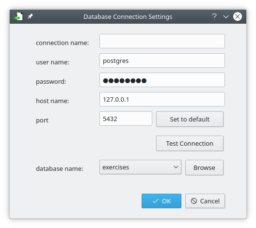

PatriciaSQL
=============

This is very simple PostgreSQL client written in PyQt (Qt GUI and Python). 

I am using Debian/Ubuntu compatible operating system + KDE Plasma as my desktop environment. I haven't tested this tool neither on other Linux distros, nor on other operating systems (OXS, Windows etc). This should work without any problems (as both Qt and Python are widely available) but some additional dependencies may be required (especially for database connectivity, or development of the app on other OS).

Screenshots:
------------

Usage:
------

After configuring this tool should be ready to use. To configure connection use the "Connection Setup" dialog availabe from the main menu (File->Settings).

Shortcuts:
----------
I like using shortcuts and most actions are available by key combinations:

<kbd>ctrl</kbd> + <kbd>Enter</kbd> - execute query - this takes whole text from the editor window and treats it as a query

<kbd>ctr</kbd> + <kbd>shift</kbd> + <kbd>Enter</kdb> - executes only selected text

<kbd>ctr</kbd> + <kbd>e</kdb> - performs explain on the query - query is the whole text from the editor control

<kbd>ctr</kbd> + <kbd>shift</kbd> + <kbd>e</kdb> - gets selected text and explain the query

Requirements:
---------------

- `Python` (either 2.7x or 3.x)
- `PostgreSQL` (it was tested with PosgreSQL 10 & 11)
- `libqt5sql5-psql`  (PostgreSQL driver for KDE apps, and is required for every app that interacts with PostgreSQL)

Additional dependencies:

|Python 2.x | Python 3.x |
|-----------|------------|
| `python-pyqt5` | `python3-pyqt5` |
| `python-pyqt5.qtsql` | `python3-pyqt5-qtsql` |

Development:
--------------

Apart from what is listed above, some additional libraries & tools may be needed, in case you want to to work on this app.

1. Qt Designer (for forms design) `sudo apt install qt-creator`
2. PyQt5 dev tools: `sudo apt install pyqt5-dev-tools`

In case something doesn't work, try installing:
  * `python-pyside2.qtsql`
  
  or
  
  * `python3-pyside2.qtsql`

Todo:
------
This section should rather be entitled "what would I like to have", as I am not sure I will have enough time to work on all of these:

 - [x] syntax highlighting for PgSQL statements
 - [ ] load & save documents (from/to .sql files)
 - [ ] query execution improvements:
    - [x] execute only highlighted text (execute one of many queries)
    - [x] 'execute and explain' + 'execute selected and explain'
    - [ ] displaying db errors on query execution
 - [ ] general UI improvements:
    - [ ] additional info on query execution (execution time)
    - [ ] solarized-light theme for the editor
 - [ ] auto-complete:
    - [ ] keywords autocomplete
    - [ ] words used autocomplete
    - [ ] database names, table names, column names... (*)
 - [ ] .deb package
 - [ ] store connection information in human readable format (now it is saved using pickle)
   
(*) I am afraid that this is going to be pretty tricky one

Disclaimer:
--------------
It was more of an experiment. I have no plans at the moment to make it a "full blown" tool. It should stay simple (and hopefully - fast). There are couple of things I would like to improve (listed in TODO section), but working on it is not very high on my priority list (read: it may happen any moment that I stop working on it).
